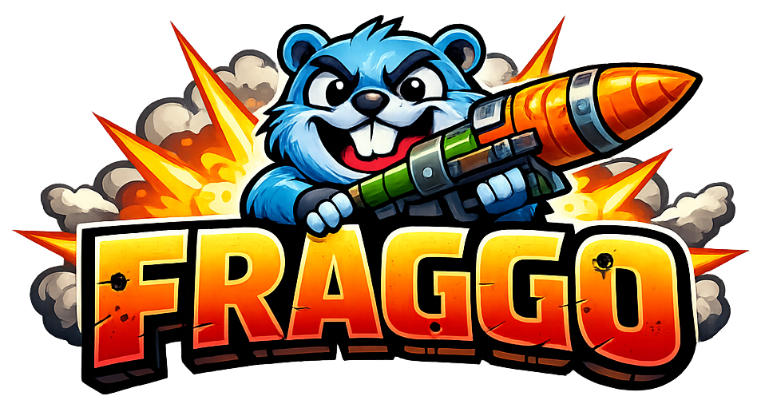

# FragGo

FragGo is a game written in Go: a fast, intense multiplayer action shooter built around platform frag combat.

Its main hook is **Mayhem Mode**. As the deathmatch progresses, the overall game speed keeps rising until the final stretch becomes brutally fast, chaotic, and barely controllable in the best possible way.

## Why It Stands Out

- Intense multiplayer action is the core USP
- High-mobility arena shooter combat
- Mayhem Mode steadily escalates the pace of the whole match

## Run

```bash
GOTOOLCHAIN=auto go run ./cmd/go3d
```

## Dependencies

see [G3n Engine Dependencies](https://github.com/g3n/engine?tab=readme-ov-file#dependencies)
